<!-- brief:start -->

<a href="https://vetswhocode.io">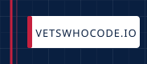</a>
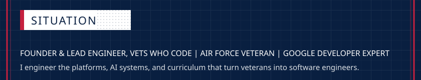
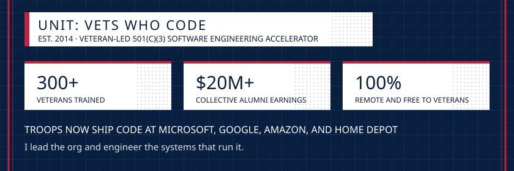
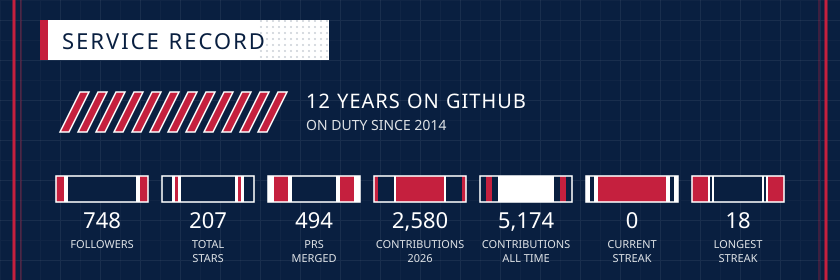
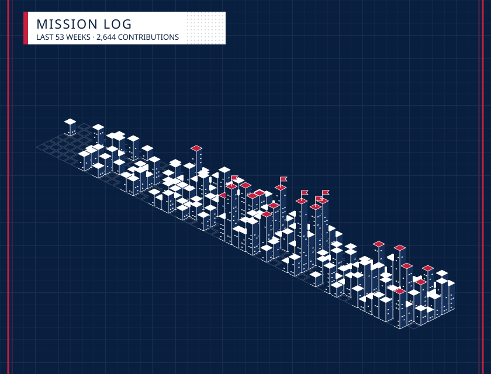

<a href="https://github.com/Vets-Who-Code/vetswhocode-vs-code-theme">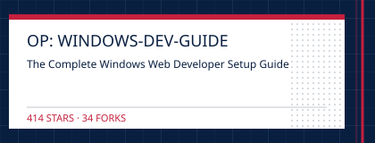</a>
<a href="https://vets-who-code.github.io/">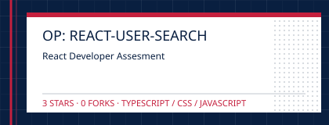</a><a href="https://github.com/Vets-Who-Code/Prework">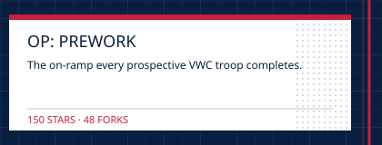</a>
<a href="https://github.com/Vets-Who-Code/hashflag-skills">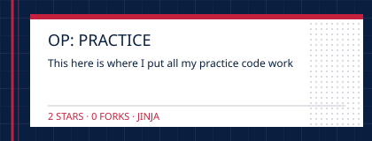</a><a href="https://github.com/Vets-Who-Code/vetswhocode-extension-pack">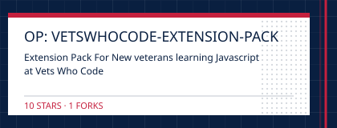</a>

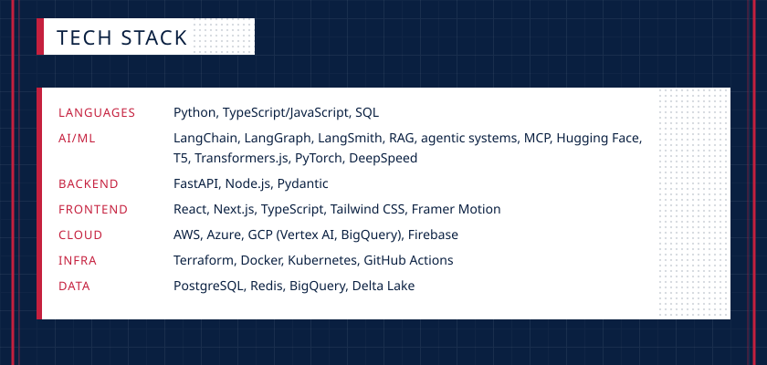
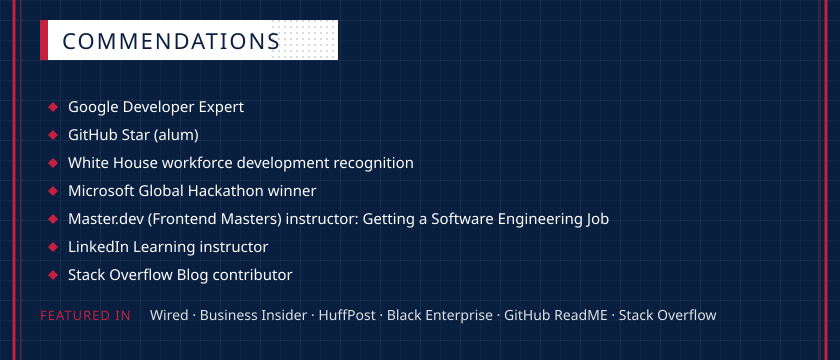
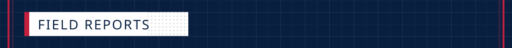
<a href="https://github.com/readme/guides/teaching-with-github">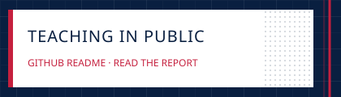</a>

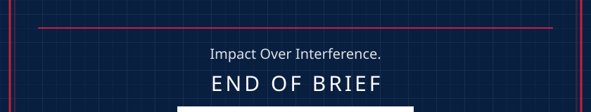
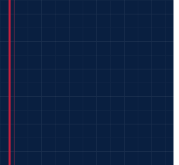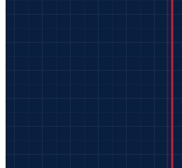

<!-- brief:end -->
